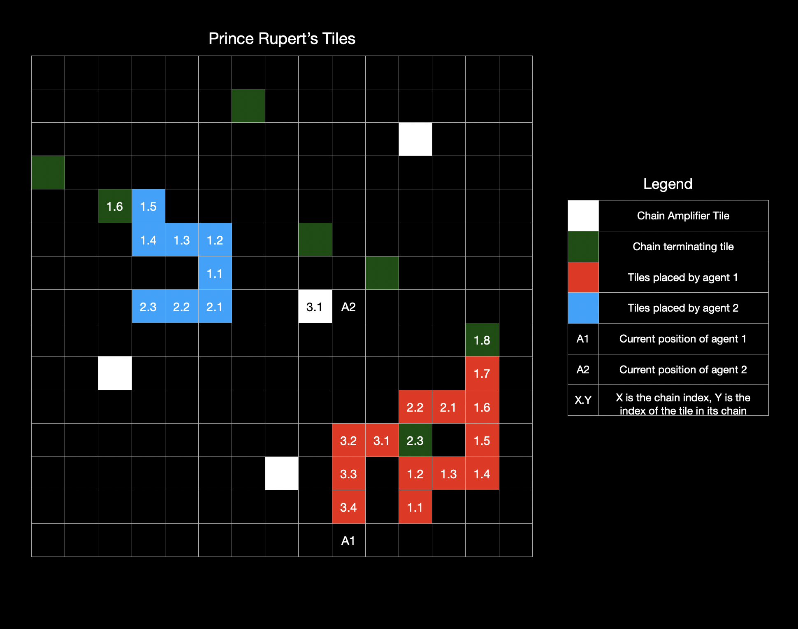

# Prince Rupert's Tiles

Ever head of a Prince Rupert's drop? How they are indestructible through physical force except at it's tail, where a small impact will cause the entire drop to shatter?

Well if you have, and you enjoy the concept, Welcome to Prince Rupert's Tiles!

The name speaks for itself..

**Prince Rupert’s Tiles** is a programming game inspired by that idea. You control a bot, lay down tiles, build chains, and try to protect your "tail"—while trying to break your opponent’s.

---

## 🗺️ The Game Board
- The game is played on a 12 × 12 grid.

- Each player controls one bot.

- Bots start at random positions on the grid.

- The board contains special Chain-Terminating Tiles and Chain Amplifier Tiles (explained below).

## 🧱 Chains and Tiles
- Bots lay down tiles to build chains.

- A chain starts with a tail (the first tile) and grows by placing adjacent tiles. 
  - Each chain can be identified by its index with the first chain being numbered 1, the second 2 and so on

- Each tile must be orthogonally adjacent to the previous tile (no diagonal placement).
  
- The first tile is automatically placed at the starting position of the bot

## 🛑 When a Chain Ends
A chain ends immediately when:

- The bot uses the TERMINATE command.

- The bot places a tile on a Chain-Terminating Tile.

- The bot steps on an opponent’s tile.

- The bot places a tile not adjacent to its previous tile (this auto-terminates the chain).

When a chain ends, the next tile placed becomes the tail of a new chain..

---

## Turns
Every turn, a bot can either:
  1. Apply **one or more** of the following commands in one line, **satisfying the relative order** of the commands in the following list
     1. `TERMINATE` - Terminates the current chain if the bot is currently building one
     2. `TELEPORT TILE_INDEX` - If the bot is currently standing on its tile, it can teleport to any other tile in the same chain
        - However a bot may only teleport **once per chain**
        - Helps confuse the opponent (makes it harder to guess your chain's tail).
     3. `MOVE DIRECTION` where DIRECTION is one of `U`,`D`,`L`,`R` standing for up,down,left,right respectively
     4. `LAY`, places a tile on the current cell of the bot (after previous commands in the line if any are applied) if the cell is empty
  2. If on an opponent tile, the bot can use
     1. `INFO`
     2. `DESTROY` as described below in the Attacking section
  
## 🔒 Fog of War

- Bots **don’t see real-time updates**.
- The map is updated for both bots every **K turns** (e.g. every 6 turns).
- This means bots must make decisions without always seeing what the opponent just did.
  
---

## 🥷 Attacking

If your bot steps on an opponent’s tile, it can:

- `INFO`
  - Gives some hint about the position of the tail relative to the tile the bot has used the commant on
  - Hint is to be decided
  - **Costs 4 points.**

- `DESTROY`: Try to destroy the opponent’s whole chain.
  - Only works if the tile is the **tail**.
  - Success = **you earn 3*L points**, where L is the length of the chain.
    - Both bots are immediately let known of all the tiles in the chain just destroyed, including the tiles not yet visible on the map
  - Fail = **you lose 8 points.**
    - The bot is notified that they failed
   
---
## 🧮 Scoring

| Action                                  | Points     |
| --------------------------------------- | ---------- |
| Build a chain of length L that survives | **+2 × L** |
| Destroy opponent’s chain of length L    | **+3 × L** |
| Start a chain on an **Amplifier Tile**  | **+L**     |
| Use `INFO` command                      | **−4**     |
| Fail a `DESTROY` command                | **−8**     |

---

## ⏲️ Game Duration

- The game ends either when **210 turns** are done or all tiles of a bot are destroyed.
- Turns alternate between the two bots.
- At the end, the player with the most points wins.

---

## 🗺️ Special Map Tiles

### Chain-Terminating Tiles
  - Hidden on the map.
  - Laying a tile on one immediately ends the current chain and disables the tile (it won't have any effect in the future)
### Chain Amplifier Tiles
  - Visible from the start.
  - Starting a chain on one grants +L bonus points, where L is the final length of that chain.
  - Laying a tile on one immediately ends the current chain and disables the tile (it won't have any effect in the future)

---

## A snapshot of the game as the engine sees it

## 🧠 Other Important Rules

- Bots don’t fight each other directly, only through tiles.
- Even if a tile hasn’t appeared on the map yet (because of the delay), a bot will **still know** there’s a tile there if it walks onto it.

## ⚙️ Core Strategy Concepts
- Chains are valuable but vulnerable: long chains score high, but their tails are easily shattered.
- Information is delayed, incomplete, and expensive—use it wisely.
- Misdirection, memory, and calculated risks are key to mastering the game.